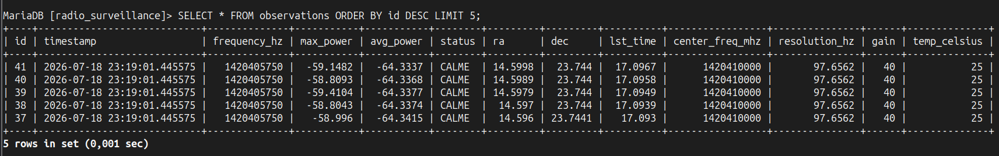
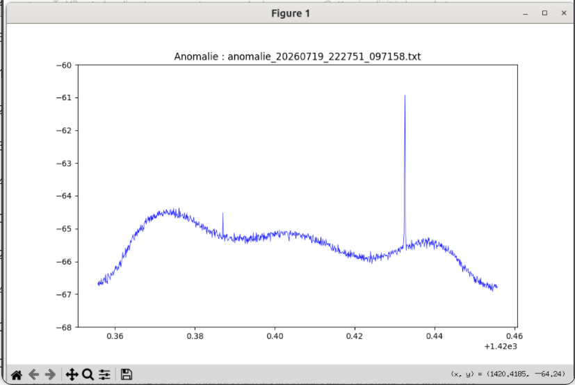
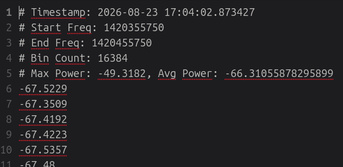
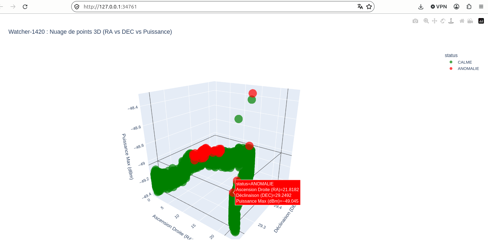
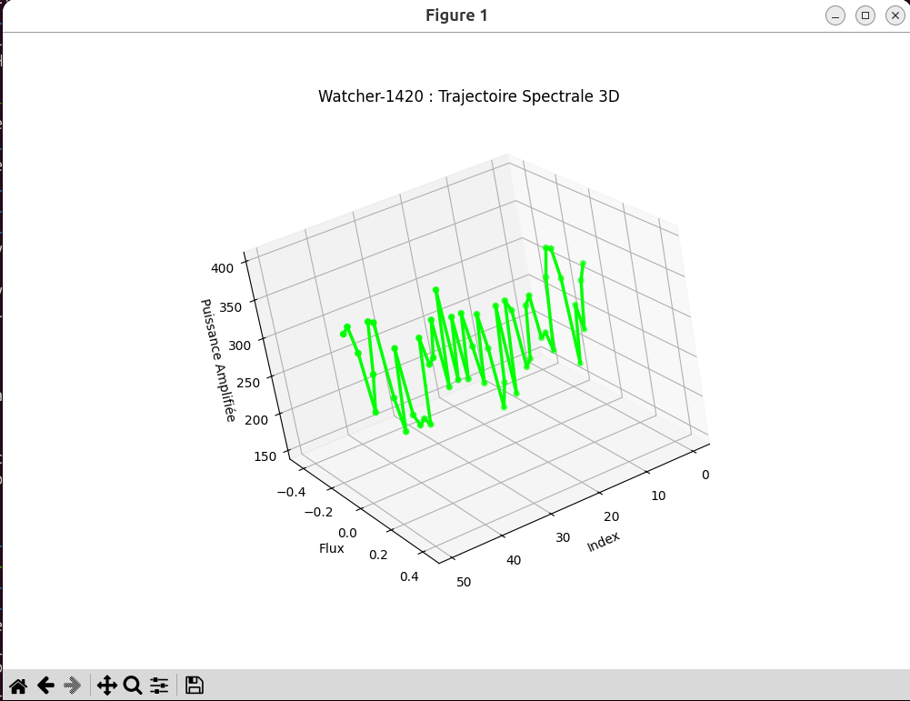

# 🛰️ Watcher-1420

## 🌌 La Mission
Dans un monde où le bruit numérique a fini par étouffer toute forme de vérité, **Watcher-1420** est une unité de surveillance autonome. Son rôle est de scruter inlassablement la fréquence de **1 420,54 MHz**, là où la raie de l'hydrogène rencontre le silence du vide. 

Cet agent n'est pas un simple télescope ; c'est un filtre. Il est déployé en autonomie sur une plateforme décentralisée, traquant les anomalies spectrales qui, dans le chaos de nos infrastructures, pourraient révéler les signaux d'une autre réalité ou le dysfonctionnement du système global.

---

## ⚙️ Architecture Technique (Phase 1)
Cette première itération utilise une plateforme de traitement compacte et un capteur abordable pour valider la chaîne de détection :

*   💻 **Unité Centrale** : i3-1215U (Architecture fanless industrielle)
*   📡 **Capteur SDR** : Clé RTL-SDR (pour l'acquisition spectrale initiale)
*   🐧 **OS** : Ubuntu (Optimisation temps réel)
*   🐍 **Middleware** : Python 3.x, NumPy, SciPy (Traitement FFT)
*   🤖 **Algorithme** : Isolation Forest (Détection d'anomalies non supervisée)

---

## 🛠️ Installation et Déploiement

### 1. Cloner le dépôt sur votre poste
```bash
git clone https://github.com/TVIEIL/Watcher-1420.git watcher1420
cd watcher1420
```

### 2. Lancer le script d'installation globale
Le script `install.sh` automatise l'installation de Miniconda, la création de l'environnement virtuel, l'installation de MariaDB, le déploiement du service mDNS Avahi et la configuration du service systemd :
```bash
chmod +x install.sh
./install.sh
```

---

## 🔬 Calibration et Entraînement du Modèle

### 1. Création du profil de bruit de fond (Calibrage)
Avant de lancer la surveillance continue, il est nécessaire d'établir la référence du bruit local à l'aide du script de calibration :
```bash
conda activate watcher1420
python src/setup_background_noise_profile_HI_V0_4.py
```
*Cela génère les fichiers de référence (`baseline_hi.npy`, etc.) indispensables pour distinguer le bruit thermique des signaux anormaux.*

### 2. Collecte des échantillons
Laissez tourner la station pendant une période prolongée pour accumuler des mesures de référence dans la base de données MariaDB (`radio_surveillance`).
&nbsp;
```
conda activate watcher1420
mysql -u watcher -pmon_mot_de_passe
USE radio_surveillance;
SELECT * FROM observations ORDER BY timestamp DESC LIMIT 5;
```
&nbsp;
### 3. Entraînement du modèle d'IA
Une fois les échantillons de référence collectés, exécute le script d'entraînement pour générer ou mettre à jour le modèle d'Isolation Forest (`watcher_model.pkl`) :
```bash
conda activate watcher1420
python src/train_watcher_model.py
```

---

## ▶️ Utilisation et Service Systemd

Le service de monitoring tourne en arrière-plan via systemd (mode utilisateur) :

- **Démarrer le service :**
  ```bash
  systemctl --user start watcher1420
  ```
- **Vérifier l'état :**
  ```bash
  systemctl --user status watcher1420
  ```
- **Suivre les logs en direct :**
  ```bash
  journalctl --user -u watcher1420 -f
  ```

---
## 📊 Galerie & Exemples

| Description & Commande | Aperçu |
| :--- | :--- |
| **Enregistrements MariaDB**<br>Stockage structuré des métadonnées et puissances spectrales. |  |
| **Détection d'Anomalie**<br>Capture graphique d'un pic suspect sur la raie à 1420 MHz. <br>`conda activate watcher1420`<br>`python src/animation_visualiser_anomalies_txt_file.py` |  |
| **Fichier d'anomalie**<br>Structure brute des logs d'incidents consignés par l'agent. |  |
| **Visualisation 3D (Nuage de points)**<br>`conda activate watcher1420`<br>`python src/plot_3d.py` |  |
| **Visualisation Isométrique Live**<br>`conda activate watcher1420`<br>`python src/exemple_script_live_isometric_watcher4.py` |  |

---
*« Si le ciel répond, Watcher-1420 sera le premier à l'entendre. »*
